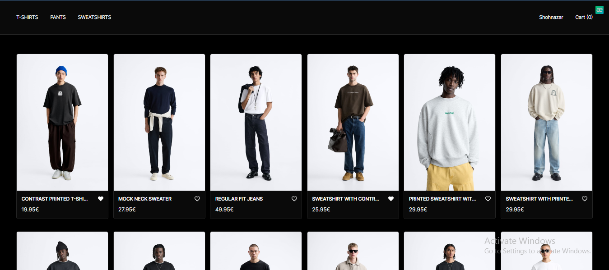

<h3>Ecommerce UI , HOMEPAGE , SINGLE PAGE , CART PAGE</h3>
<p align="center">
   <br>
   <br>
   <br>
</p>

This is a [Next.js](https://nextjs.org/) project bootstrapped with [`create-next-app`](https://github.com/vercel/next.js/tree/canary/packages/create-next-app).

# 🛠 Installation & Set Up

Install dependecies
```bash
pnpm install
```

Run the development server:
```bash
pnpm run dev
```
Open http://localhost:3000 with your browser to see the result.

## Learn More

To learn more about Next.js, take a look at the following resources:

- [Next.js Documentation](https://nextjs.org/docs) - learn about Next.js features and API.
- [Learn Next.js](https://nextjs.org/learn) - an interactive Next.js tutorial